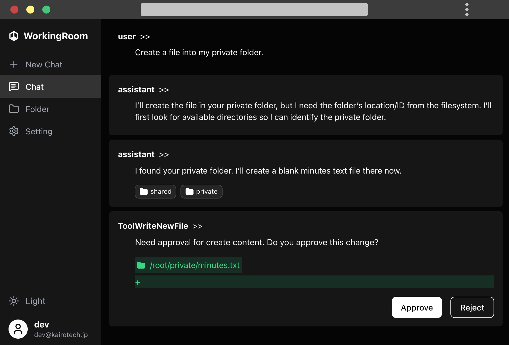
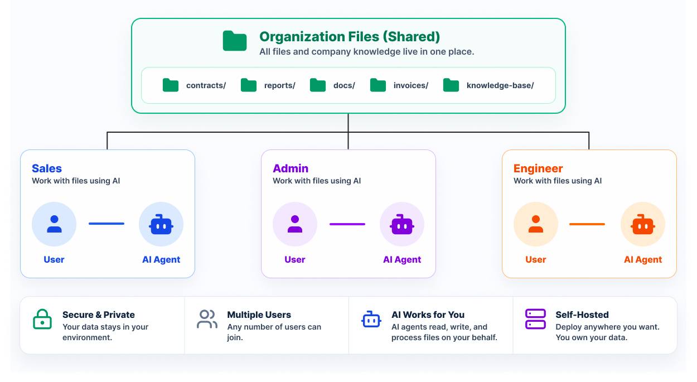

# WorkingRoom

[WorkingRoom](https://workingroom.io) is an open source shared workspace for teams and AI agents.

<p align="center">
  
  <br />
  <em>AI agents operate on shared files with human approval workflows.</em>
</p>

<br />

Files, documents, and company knowledge live in one place. Humans and AI collaborate through a unified interface for files, permissions, and access control.

AI agents can safely read, write, search, and process content under human-defined boundaries.

<p align="center">
  
  <br />
  <em>Humans and AI collaborate through a shared workspace.</em>
</p>

> [!WARNING]
> WorkingRoom is currently in early development (v0.1.x).
> APIs and database schemas may change before v1.0.

## Features

- Shared workspace for teams and AI agents
- File access control and permission boundaries
- Human approval workflows before AI changes are applied
- Full change history and audit trails
- Built-in AI chat interface
- Open source and self-hostable

## Architecture

```
apps/
  web/     → Next.js 15 web app (primary UI)
  docs/    → Docusaurus documentation site
packages/
  access/      → Blob data, provider, and service integrations
  composition/ → Dependency wiring across workspaces
  core/        → Core engine for agents, prompts, tools, events, and maps
  db/          → Prisma schema, migrations, and database access
  shared/      → Shared TypeScript types and cross-runtime utilities
  shared-node/ → Node.js-specific shared utilities
  testing/     → Shared testing fixtures and helpers
```

## Quick Start (Docker)

The fastest way to run WorkingRoom:

```bash
# Set ANTHROPIC_API_KEY and/or OPENAI_API_KEY in your shell environment,
# then run:
docker compose up
```

Migrations run automatically on startup.

Open `http://localhost:3000`.

## Local Development

**Prerequisites:** Node.js 20–22, Yarn 4+, Anthropic and/or OpenAI API key

```bash
# 1. Install dependencies
corepack enable
yarn install

# 2. Configure environment
# .env.local is committed with local development defaults
# Set ANTHROPIC_API_KEY and/or OPENAI_API_KEY in your shell environment

# 3. Initialize database
yarn prisma:dev

# 4. Start web app
yarn dev:web
```

## Common Scripts

| Command                | Description                                 |
| ---------------------- | ------------------------------------------- |
| `yarn dev:web`         | Start the web app in development            |
| `yarn dev:docs`        | Start the documentation site                |
| `yarn build:web`       | Build the web app for production            |
| `yarn start:web`       | Build and start the web app                 |
| `yarn prisma:dev`      | Run Prisma development migrations           |
| `yarn prisma:reset`    | Reset the database and re-run setup         |
| `yarn prisma:generate` | Regenerate the Prisma client                |
| `yarn prisma:deploy`   | Apply Prisma migrations                     |
| `yarn test`            | Run the test suite                          |
| `yarn test:watch`      | Run tests in watch mode                     |
| `yarn coverage`        | Run tests with coverage                     |
| `yarn lint`            | Check TS and TSX files with Prettier        |
| `yarn lint-fix`        | Format TS and TSX files with Prettier       |
| `yarn seed:docs`       | Apply docs DB migrations and seed docs data |
| `yarn start:web:docs`  | Start the web app with the docs environment |

## Environment Variables

`.env.example` defines the base environment variables for the app. In local development, `.env.local` also provides local defaults such as `ENV=local` and `NEXTAUTH_SECRET=local`.

| Variable            | Required | Default                 | Description                                                |
| ------------------- | -------- | ----------------------- | ---------------------------------------------------------- |
| `DATABASE_URL`      | Yes      | `file:./dev.db`         | Database connection string                                 |
| `NEXTAUTH_URL`      | Yes      | `http://localhost:3000` | App base URL                                               |
| `NEXTAUTH_SECRET`   | Yes      | Empty in `.env.example` | Session signing secret                                     |
| `ANTHROPIC_API_KEY` | Yes\*    | —                       | Anthropic Claude API key                                   |
| `OPENAI_API_KEY`    | Yes\*    | —                       | OpenAI API key                                             |
| `MULTI_TENANT`      | No       | `false`                 | Enables multi-tenant mode; currently not available         |
| `ROOT_DIR`          | No       | `~/.wr`                 | Workspace directory root; files are stored under this path |

\*At least one AI provider key is required.

## Self-Hosting

WorkingRoom is designed to be hosted per-organization.

Each organization runs its own isolated instance, ensuring data separation at the infrastructure level.

See Docker setup above.

Additional deployment examples, infrastructure templates, and database configuration can be found in the [documentation](https://workingroom.io).

## Contributing

See [CONTRIBUTING.md](CONTRIBUTING.md).

## License

Licensed under the Apache License 2.0.
See [LICENSE](LICENSE).
