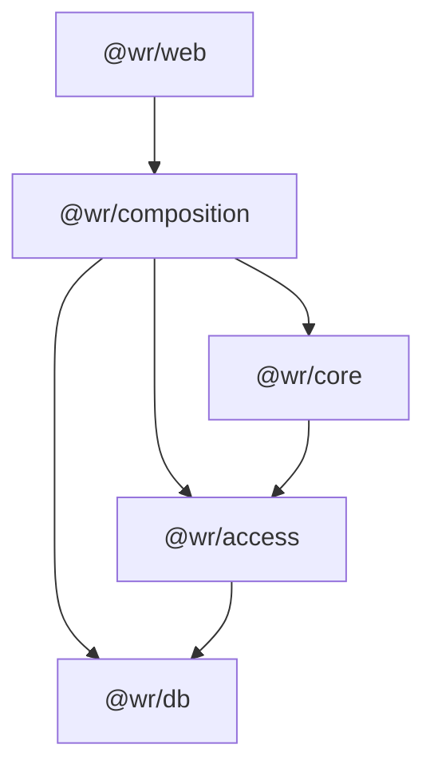
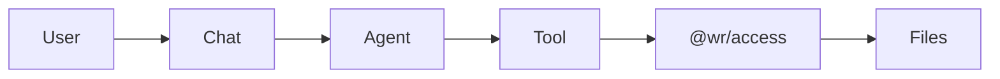

# Architecture

## Overview

WorkingRoom is designed around a layered architecture that separates AI execution, business logic, resource access, and persistence.

This separation allows AI agents to interact with files and external resources safely through controlled access layers rather than accessing infrastructure directly.

## Package Dependencies



### Package Responsibilities

| Package           | Responsibility                                                                    |
| ----------------- | --------------------------------------------------------------------------------- |
| `@wr/web`         | Web application, UI components, routes, API endpoints, and web-specific workflows |
| `@wr/composition` | Dependency injection and service composition                                      |
| `@wr/core`        | Business logic, AI agents, tools, and domain services                             |
| `@wr/access`      | Access layer for files, databases, and external resources                         |
| `@wr/db`          | Database access and persistence                                                   |
| `@wr/shared`      | Shared types, errors, and utilities                                               |
| `@wr/shared-node` | Node.js-specific shared utilities                                                 |
| `@wr/testing`     | Shared testing fixtures and helpers                                               |

For readability, `@wr/shared`, `@wr/shared-node` and `@wr/testing` Test utilities, fixtures, temporary workspaces, and test database setup are omitted from the dependency graph because they are used across multiple packages.

## AI Execution Flow

WorkingRoom uses an agent-based execution model.

User requests are processed by AI agents, which invoke tools to perform actions. Tools never access infrastructure directly. Instead, all resource access is routed through the access layer.



## Design Principles

### Controlled Resource Access

Agents do not access files, databases, or external systems directly.

All operations are performed through tools and the access layer, which provides a controlled boundary between AI-generated actions and system resources.

### Separation of Concerns

Each package has a clearly defined responsibility:

- Applications handle user interaction.
- Core contains business logic and AI execution.
- Access provides resource access abstractions.
- Database handles persistence.

This separation improves maintainability and testability.

### Dependency Direction

Dependencies always flow toward lower-level infrastructure layers.

```text
Apps
  ↓
Composition
  ↓
Core
  ↓
Access
  ↓
Database
```

Business logic remains independent from application frameworks and storage implementations wherever possible.

### Workspace-Centric Architecture

WorkingRoom is built around the concept of a shared workspace.

AI agents operate on workspace resources through controlled interfaces, enabling humans and AI to collaborate safely on the same files and data.
