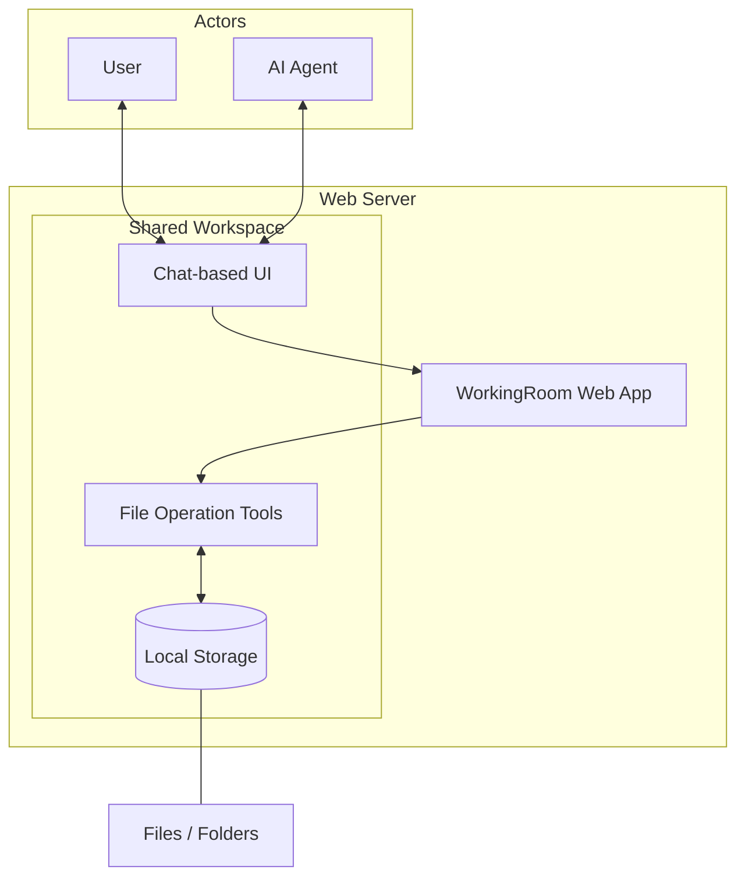

import Screenshot from "@site/src/components/Screenshot"

# WorkingRoom

<Screenshot alt="WorkingRoom concept diagram" light="/img/concept.png" dark="/img/concept.png" />

## Why WorkingRoom Exists

AI models have improved rapidly in recent years.

However, in real business environments, model capability alone is not enough.
What matters more is:

- what information AI can access
- whose authority is used for an operation
- what was changed
- how mistakes and unintended actions are prevented

No matter how capable an AI model is, it is not practical for business use if it cannot access operational data safely.

In collaborative environments, AI must also operate with the same kinds of boundaries, permissions, and responsibilities that human team members have.

WorkingRoom was created to solve this problem.

## What is WorkingRoom?

WorkingRoom is an open source workspace where humans and AI collaborate while sharing the same data space.

It combines chat, files, and permission management so that AI can work safely inside a real team environment.

WorkingRoom is not just file management with an AI chat interface.

Its core idea is:

**a workspace where humans and AI share the same data space and collaborate safely.**

AI in WorkingRoom is not treated as a simple chatbot.
As part of the team, it can:

- read files
- edit files
- organize information
- execute tasks

At the same time, it operates under appropriate access control just like a human user.

## Our Perspective on AI

We do not believe AI should replace humans.

AI is powerful, but it can still:

- make incorrect decisions
- overlook important information
- misunderstand instructions

Because of that, the important goal is not to trust AI blindly.

The real goal is to create an environment where AI can be managed safely.

WorkingRoom is designed to make practical use of AI while emphasizing:

- permission control
- operation history
- auditability
- approval flows

## AI-Native Workspace

Traditional file sharing systems and groupware are designed for collaboration between humans.

WorkingRoom is designed from the beginning for teams where AI is also an active participant.

AI can:

- search files
- understand content
- organize information
- assist with work

But final control always remains with humans.

## Open Source

WorkingRoom is open source software.

We believe the relationship between AI and business data will become a foundational part of future software infrastructure.

Because of that, we value the ability to:

- inspect the code
- verify how the system works
- deploy it in your own environment
- extend it freely

## Vision

Our goal is to build a standard workspace where humans and AI can collaborate safely.

As AI becomes a normal participant in daily operations, WorkingRoom provides the foundation for that future.
