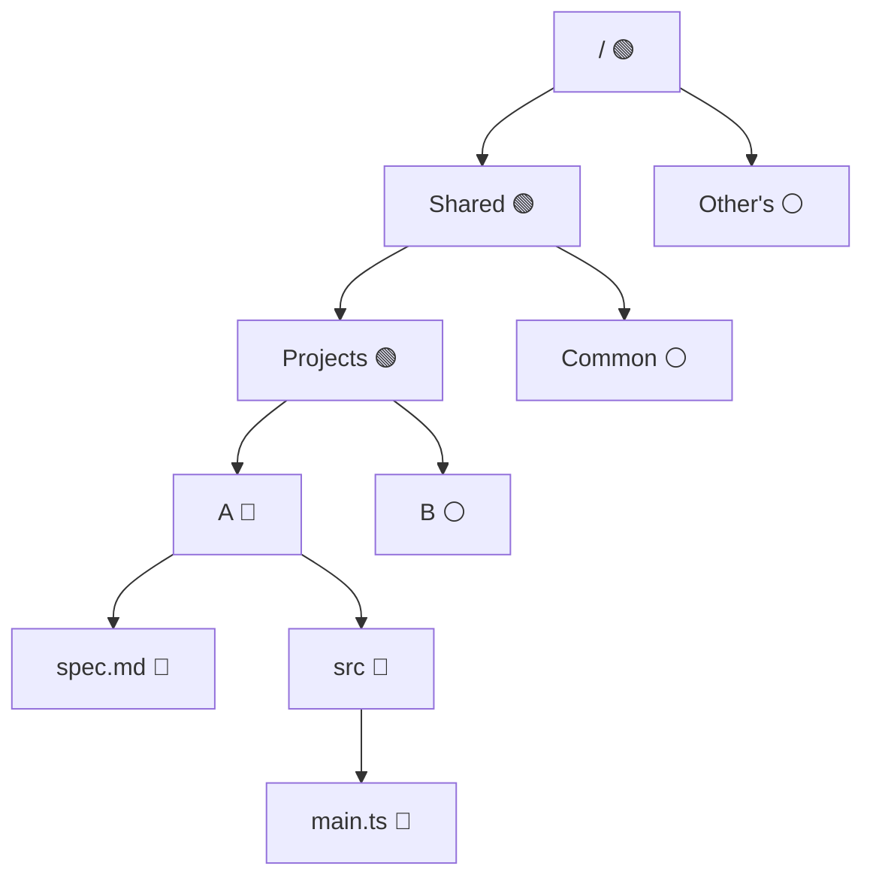

import Screenshot from "@site/src/components/Screenshot"

# File Access Control

WorkingRoom uses a **whitelist-based**, role and policy-based access control system for files and directories in the shared file system.
Access is denied by default — users can only access resources explicitly granted through their assigned policies.

## Permission Model

Access is structured as a three-level hierarchy:

```
User → Roles → Policies → Resources (files / folders)
```

Each **policy** grants either `read` or `write` permission to specific files or directories.
Policies are grouped into **roles**, and roles are assigned to users within a tenant.

> **Write implies read.** A user with write access to a resource automatically has read access to it as well.

## Access Rules

The following rules apply when a user has a policy on folder A:

| Situation                 | Read ancestors of A | Read contents under A | Write contents under A |
| ------------------------- | :-----------------: | :-------------------: | :--------------------: |
| Has **read** policy on A  |         ✅          |          ✅           |           ❌           |
| Has **write** policy on A |         ✅          |          ✅           |           ✅           |

Additional rules for write permission:

- The user can create, rename, move, and delete files and subdirectories inside A.
- The user can rename A itself and move A to another directory.

**Ancestor folder visibility:** When listing a folder that is an ancestor of an accessible folder, only the subdirectories that lead toward the accessible folder are shown. Other sibling directories remain hidden.

## Example

Suppose a user has write access to directory A. The following chart shows which directories the user can access.

- 🔵 Write access (implies read)
- 🟢 Read access (ancestor of A)
- ⚪ No access



Note that when the user lists `Projects`, only directory A is visible — directory B is hidden because it is not on the path to any accessible resource.

## Default Setup

When a user is invited to a tenant, a default role is automatically assigned that grants access to two directories:

| Directory  | Permission | Description                                        |
| ---------- | :--------: | -------------------------------------------------- |
| `/shared`  |   Write    | Common space accessible to all users in the tenant |
| `/private` |   Write    | Personal space visible only to the owning user     |

Because roles are tenant-scoped, each user's default role includes a policy scoped to their own `/private` directory — other users' `/private` directories are not included and remain inaccessible.
