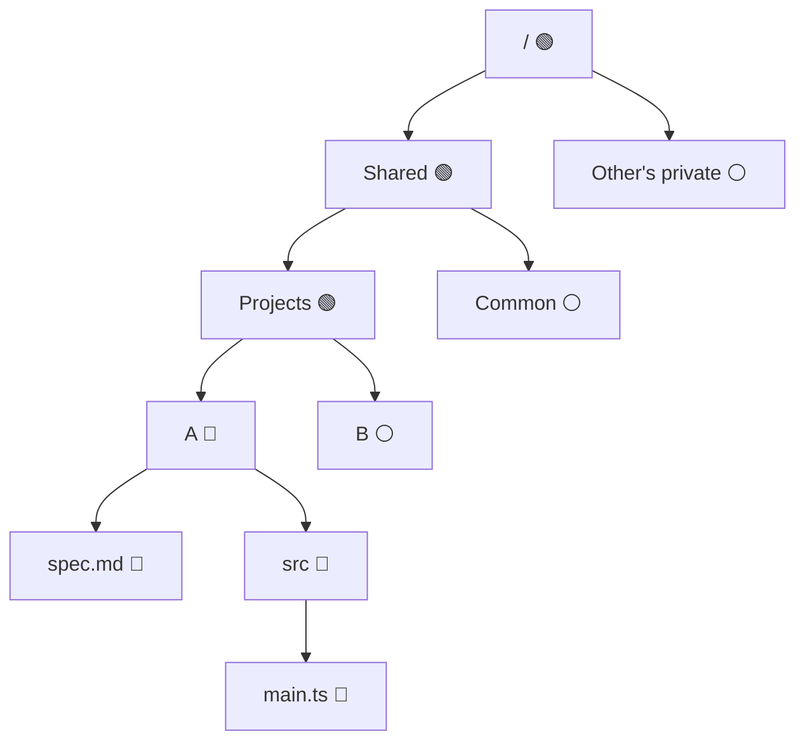

import Screenshot from "@site/src/components/Screenshot"

# File Access Control

WorkingRoom uses a **whitelist-based** access control system for files and directories in the shared file system.
Access is denied by default — users can only access resources explicitly granted through their assigned Access Groups.

## Permission Model

Access is structured as a two-level hierarchy:

```
User → Access Groups → Resources (files / folders)
```

An **Access Group** grants either `read` or `write` permission to one or more files or directories.
Each user can belong to multiple Access Groups, and their effective access is the union of all groups they belong to.

> **Write implies read.** A user with write access to a resource automatically has read access to it as well.

## Access Groups

An Access Group is a named set of resource permissions that can be assigned to one or more users within a tenant.

Each Access Group has:

- A **name** and optional description
- A **read** or **write** permission flag
- One or more **resources** (files or directories) that the permission applies to

### Personal Access Groups

A **personal access group** (`isPersonal: true`) is scoped to a single user.
It is created automatically when a user joins the tenant and is not shared with others.

### Shared Access Groups

A shared access group can be assigned to multiple users.
Owners use these to grant access to common resources such as the root directory.

## Access Rules

The following rules apply when a user belongs to an Access Group with a policy on folder A:

| Situation                          | Read ancestors of A | Read contents under A | Write contents under A |
| ---------------------------------- | :-----------------: | :-------------------: | :--------------------: |
| Has **read** group policy on A     |         ✅          |          ✅           |           ❌           |
| Has **write** group policy on A    |         ✅          |          ✅           |           ✅           |

Additional rules for write permission:

- The user can create, rename, move, and delete files and subdirectories inside A.
- The user can rename A itself and move A to another directory.

**Ancestor folder visibility:** When listing a folder that is an ancestor of an accessible folder, only the subdirectories that lead toward the accessible folder are shown. Other sibling directories remain hidden.

**Private directory isolation:** A user cannot access another user's private directory in any case — even if the user holds a write policy on an ancestor folder that contains the other user's private directory.

## Example

Suppose a user has write access to directory A. The following chart shows which directories the user can access.

- 🔵 Write access (implies read)
- 🟢 Read access (ancestor of A)
- ⚪ No access



Note that when the user lists `Projects`, only directory A is visible — directory B is hidden because it is not on the path to any accessible resource.

## Default Setup

Access Groups are created automatically when a user joins a tenant.

### Owner (signup)

When the tenant owner signs up, two Access Groups are created:

| Access Group          | Resource       | Permission | Description                                     |
| --------------------- | -------------- | :--------: | ----------------------------------------------- |
| Owner access group    | `/` (root)     |   Write    | Grants full access to the entire file system    |
| Personal access group | `/private`     |   Write    | Personal space visible only to the owner        |

### Invited users

When a user is invited to a tenant, one personal Access Group is created:

| Access Group          | Resource   | Permission | Description                                  |
| --------------------- | ---------- | :--------: | -------------------------------------------- |
| Personal access group | `/private` |   Write    | Personal space visible only to the user      |

Invited users do not receive access to the shared directory by default.
An administrator must explicitly add them to an Access Group that covers `/shared` or other shared resources.

:::note

Other users' `/private` directories are never accessible, regardless of which Access Groups a user belongs to.
This isolation is enforced at the access layer and cannot be overridden by Access Group assignment.

:::
