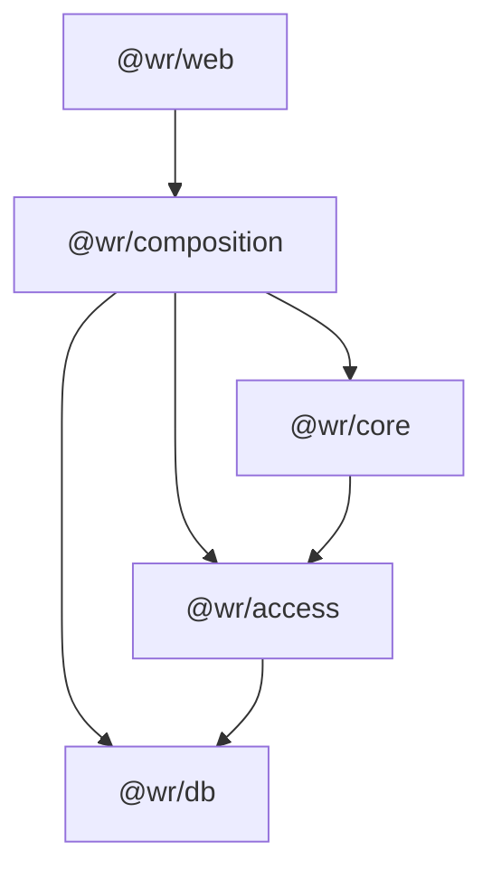

# アーキテクチャ

## 概要

WorkingRoom は、AI の実行、ビジネスロジック、リソースアクセス、および永続化を分離した階層型アーキテクチャを基盤として設計されています。

この分離により、AI エージェントはインフラに直接アクセスするのではなく、制御されたアクセス層を通じてファイルや外部リソースと安全にやり取りできます。

## パッケージの依存関係



### パッケージの責任

| パッケージ        | 責任                                                                              |
| ----------------- | --------------------------------------------------------------------------------- |
| `@wr/web`         | Web アプリケーション、UI コンポーネント、ルート、API エンドポイント、Web 固有のワークフロー |
| `@wr/composition` | 依存性注入とサービスの構成                                                         |
| `@wr/core`        | ビジネスロジック、AI エージェント、ツール、ドメインサービス                        |
| `@wr/access`      | ファイル、データベース、外部リソースへのアクセス層                                 |
| `@wr/db`          | データベースアクセスと永続化                                                       |
| `@wr/shared`      | 共有型、エラー、ユーティリティ                                                     |
| `@wr/shared-node` | Node.js 固有の共有ユーティリティ                                                   |
| `@wr/testing`     | 共有テストフィクスチャとヘルパー                                                   |

読みやすさのため、`@wr/shared`、`@wr/shared-node`、`@wr/testing` は複数のパッケージで使用されているため依存関係グラフから省略しています。

## AI の実行フロー

WorkingRoom はエージェントベースの実行モデルを採用しています。

ユーザーのリクエストは AI エージェントによって処理され、エージェントはツールを呼び出してアクションを実行します。ツールはインフラに直接アクセスしません。すべてのリソースアクセスはアクセス層を通じてルーティングされます。


## 設計原則

### リソースアクセスの制御

エージェントはファイル、データベース、外部システムに直接アクセスしません。

すべての操作はツールとアクセス層を通じて実行されます。これにより、AI が生成したアクションとシステムリソースの間に制御された境界が提供されます。

### 関心の分離

各パッケージには明確に定義された責任があります：

- アプリケーションはユーザーインタラクションを処理します。
- Core はビジネスロジックと AI の実行を担います。
- Access はリソースアクセスの抽象化を提供します。
- Database は永続化を担います。

この分離により保守性とテスト容易性が向上します。

### 依存関係の方向

依存関係は常に下位のインフラ層に向かって流れます。

```text
Apps
  ↓
Composition
  ↓
Core
  ↓
Access
  ↓
Database
```

ビジネスロジックは、可能な限りアプリケーションフレームワークやストレージの実装から独立した状態に保たれます。

### ワークスペース中心のアーキテクチャ

WorkingRoom は共有ワークスペースのコンセプトを中心に構築されています。

AI エージェントは制御されたインターフェースを通じてワークスペースのリソースを操作します。これにより、人間と AI が同じファイルやデータ上で安全に協働できます。
