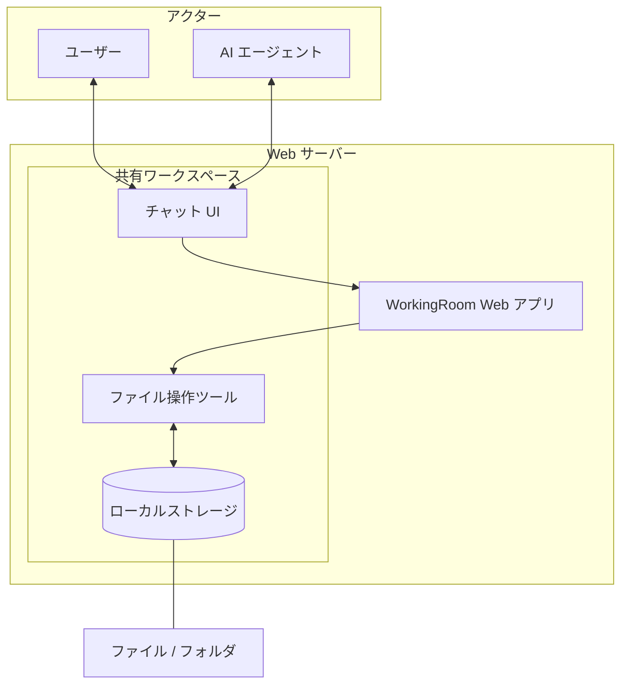

import Screenshot from "@site/src/components/Screenshot"

# WorkingRoom

<Screenshot alt="WorkingRoom コンセプト図" light="/img/concept.png" dark="/img/concept.png" />

## WorkingRoom が生まれた理由

近年、AI モデルの性能は急速に向上しています。

しかし、実際のビジネス環境では、モデルの能力だけでは不十分です。
本当に重要なのは：

- AI がどの情報にアクセスできるか
- どの権限で操作を行うか
- 何が変更されたか
- ミスや意図しない操作をどう防ぐか

AI モデルがどれだけ高性能であっても、業務データに安全にアクセスできなければ実用的ではありません。

チームで使う環境では、AI も人間のチームメンバーと同様に、適切な境界・権限・責任のもとで動作する必要があります。

WorkingRoom はこの課題を解決するために生まれました。

## WorkingRoom とは？

WorkingRoom は、人間と AI が同じデータ空間を共有しながら協働できるオープンソースのワークスペースです。

チャット・ファイル・権限管理を統合することで、AI が実際のチーム環境で安全に作業できます。

WorkingRoom は、単なる「AI チャット付きファイル管理」ではありません。

そのコアコンセプトは：

**人間と AI が同じデータ空間を共有し、安全に協働できるワークスペース**

WorkingRoom における AI は、単純なチャットボットとして扱われません。
チームの一員として、以下のことが可能です：

- ファイルの読み取り
- ファイルの編集
- 情報の整理
- タスクの実行

同時に、人間のユーザーと同様に適切なアクセス制御のもとで動作します。

## AI に対する私たちの考え方

私たちは、AI が人間の代わりになるべきだとは考えていません。

AI は強力ですが、それでも：

- 誤った判断をすることがある
- 重要な情報を見落とすことがある
- 指示を誤解することがある

そのため、重要な目標は AI を盲目的に信頼することではありません。

本当の目標は、AI を安全に管理できる環境を作ることです。

WorkingRoom は以下を重視しながら、AI を実用的に活用できるよう設計されています：

- 権限制御
- 操作履歴
- 監査可能性
- 承認フロー

## AI ネイティブなワークスペース

従来のファイル共有システムやグループウェアは、人間同士の協働を前提に設計されています。

WorkingRoom は、AI もアクティブな参加者として加わるチームのために、最初から設計されています。

AI は以下のことができます：

- ファイルの検索
- コンテンツの理解
- 情報の整理
- 作業のサポート

ただし、最終的なコントロールは常に人間が持ちます。

## オープンソース

WorkingRoom はオープンソースソフトウェアです。

私たちは、AI とビジネスデータの関係が将来のソフトウェアインフラの基盤になると考えています。

そのため、以下の能力を重視しています：

- コードを検査できること
- システムの動作を検証できること
- 自分の環境にデプロイできること
- 自由に拡張できること

## ビジョン

私たちの目標は、人間と AI が安全に協働できる標準的なワークスペースを構築することです。

AI が日常業務の通常の参加者になるにつれて、WorkingRoom はその未来の基盤を提供します。
