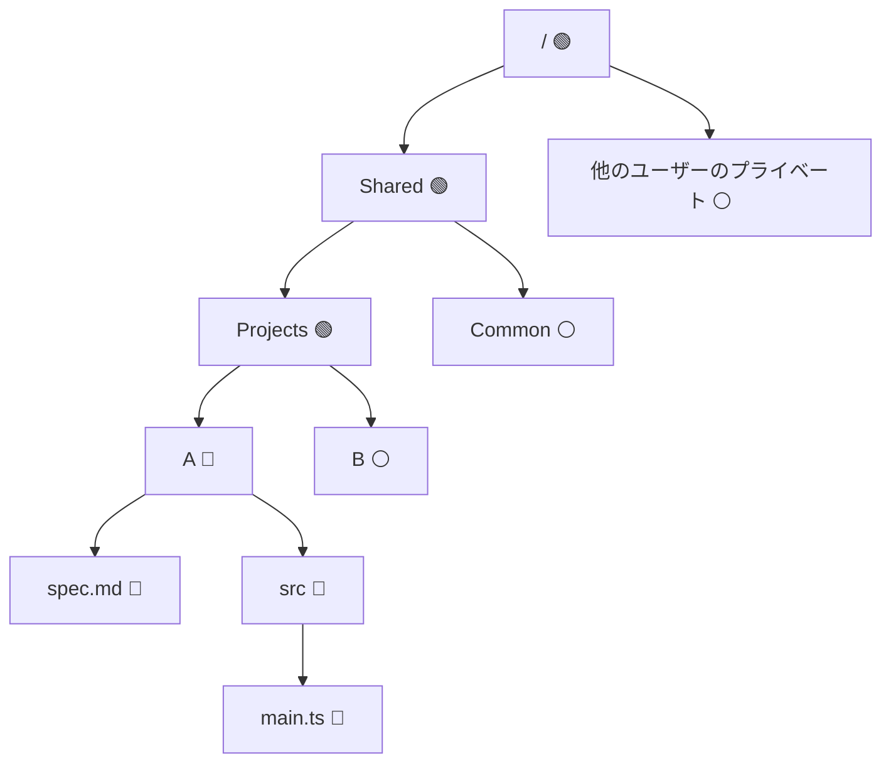

import Screenshot from "@site/src/components/Screenshot"

# ファイルアクセス制御

WorkingRoom は、共有ファイルシステム内のファイルとディレクトリに対して**ホワイトリスト方式**のアクセス制御を採用しています。
デフォルトではアクセスが拒否されており、ユーザーは割り当てられた Access Group を通じて明示的に許可されたリソースのみにアクセスできます。

## 権限モデル

アクセスは以下の 2 段階の階層構造で管理されます：

```
ユーザー → Access Group → リソース（ファイル / フォルダ）
```

**Access Group** は、1 つ以上のファイルまたはディレクトリに対して `read`（読み取り）または `write`（書き込み）の権限を付与します。
各ユーザーは複数の Access Group に所属でき、有効なアクセス権限はすべてのグループの権限の和集合となります。

> **書き込み権限は読み取りを含みます。** リソースへの書き込みアクセス権を持つユーザーは、自動的にそのリソースへの読み取りアクセス権も持ちます。

## Access Group

Access Group は、テナント内の 1 人以上のユーザーに割り当てられる、名前付きのリソース権限セットです。

各 Access Group は以下を持ちます：

- **名前**とオプションの説明
- **read** または **write** の権限フラグ
- 権限が適用される 1 つ以上の**リソース**（ファイルまたはディレクトリ）

### Personal Access Group

**Personal Access Group**（`isPersonal: true`）は単一ユーザーにスコープされます。
ユーザーがテナントに参加したときに自動的に作成され、他のユーザーとは共有されません。

### 共有 Access Group

共有 Access Group は複数のユーザーに割り当てることができます。
オーナーはこれを使用して、ルートディレクトリなどの共通リソースへのアクセスを付与します。

## アクセスルール

フォルダ A に対するポリシーを持つ Access Group にユーザーが所属している場合、以下のルールが適用されます：

| 状況                             | A の祖先を読み取り | A 以下のコンテンツを読み取り | A 以下のコンテンツを書き込み |
| -------------------------------- | :----------------: | :--------------------------: | :--------------------------: |
| A に対する **read** グループポリシーを持つ |         ✅         |             ✅               |              ❌              |
| A に対する **write** グループポリシーを持つ |        ✅         |             ✅               |              ✅              |

書き込み権限の追加ルール：

- ユーザーは A 内のファイルとサブディレクトリの作成、名前変更、移動、削除ができます。
- ユーザーは A 自体の名前変更および別のディレクトリへの移動ができます。

**祖先フォルダの可視性：** アクセス可能なフォルダの祖先フォルダを一覧表示する際、そのアクセス可能なフォルダへの経路にあるサブディレクトリのみが表示されます。それ以外の兄弟ディレクトリは非表示になります。

**プライベートディレクトリの分離：** ユーザーは、たとえ他のユーザーのプライベートディレクトリを含む祖先フォルダへの書き込みポリシーを持っていても、他のユーザーのプライベートディレクトリにはアクセスできません。

## 例

ユーザーがディレクトリ A に書き込みアクセス権を持つと仮定します。以下のチャートはユーザーがアクセスできるディレクトリを示しています。

- 🔵 書き込みアクセス（読み取りを含む）
- 🟢 読み取りアクセス（A の祖先）
- ⚪ アクセスなし



ユーザーが `Projects` を一覧表示すると、ディレクトリ A のみが表示されます。ディレクトリ B はアクセス可能なリソースへの経路上にないため非表示になります。

## デフォルトの設定

ユーザーがテナントに参加すると、Access Group が自動的に作成されます。

### オーナー（サインアップ時）

テナントのオーナーがサインアップすると、2 つの Access Group が作成されます：

| Access Group          | リソース       | 権限   | 説明                                              |
| --------------------- | -------------- | :----: | ------------------------------------------------- |
| オーナー Access Group | `/`（ルート）  | 書き込み | ファイルシステム全体へのフルアクセスを付与       |
| Personal Access Group | `/private`     | 書き込み | オーナーのみが閲覧できる個人スペース             |

### 招待されたユーザー

ユーザーがテナントに招待されると、1 つの Personal Access Group が作成されます：

| Access Group          | リソース   | 権限   | 説明                                          |
| --------------------- | ---------- | :----: | --------------------------------------------- |
| Personal Access Group | `/private` | 書き込み | そのユーザーのみが閲覧できる個人スペース     |

招待されたユーザーはデフォルトでは共有ディレクトリへのアクセス権を受け取りません。
管理者は `/shared` またはその他の共有リソースを含む Access Group に明示的に追加する必要があります。

:::note

他のユーザーの `/private` ディレクトリは、ユーザーがどの Access Group に所属していても、いかなる場合もアクセスできません。
この分離はアクセス層で強制されており、Access Group の割り当てでオーバーライドすることはできません。

:::
